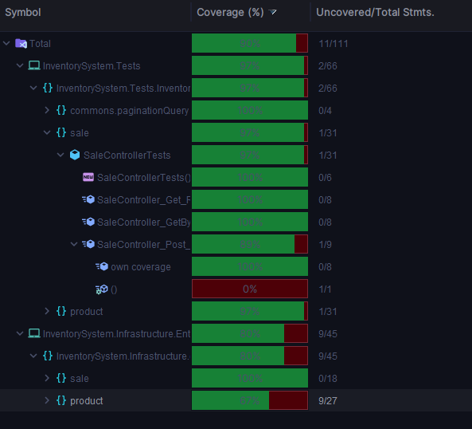

# Inventory system challenge

## Tech stack
```csharp
- .Net 6
- SQLServer
- Entity Framework
- LinQ
- XUnit
```

## Hexagonal Architecture
```csharp
- InventorySystem.Application -> Project's starting point
- InventorySystem.Domain -> Project's bussiness logic
- Inventorysystem.Infrastructure.DrivenAdapters -> Project's DataContext and Database queries
- InventorySystem.Infrastructure.EntryPoints -> Project's Handlers/Controllers
```

## Setting Up the Database

First of all, is mandatory to configure the Database ConnectionString of your own. To do so, please navigate
to **_InventorySystem.Infrastructure.DrivenAdapters.sqlServer.context.DataContext_** file and change the 
property **_DbUri_** with your SQLServer Database ConnectionString. 
After that, open a console inside **_InventorySystem.Infrastructure.DrivenAdapters_** 
folder and execute the next command -> **_dotnet run Program.cs_**.
If everything is Ok, it shoul display two messages in the console:
**"Creating Database..."** and after a couple of seconds it will display **"Database ready"**

## Run the application
To run this application, please locate the **_InventorySystem.Application_** folder in a console
and execute the next command -> **_dotnet run Program.cs_**
``

After that, paste this URL in a browser to open up the SwaggerUi https://localhost:8080/index.html

## Postman Collection
To download the postman collection, open postman and click on import and select Link option, then paste the 
following Link **_https://api.postman.com/collections/19770200-428ee503-0326-4c23-938b-41d2550d9abb?access_key=PMAT-01GNZ40YJSPT285PEJYW5PPBG5_**

To find the Postman Json File go to: [Postman](PostmanCollection/InventorySystem.postman_collection.json)


## Test Coverage Evidence
